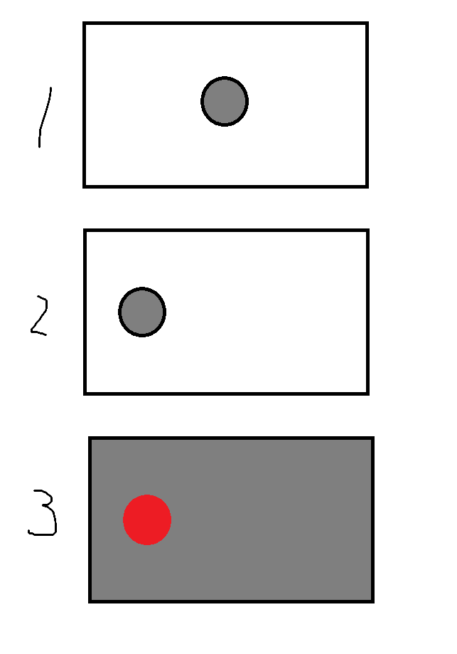
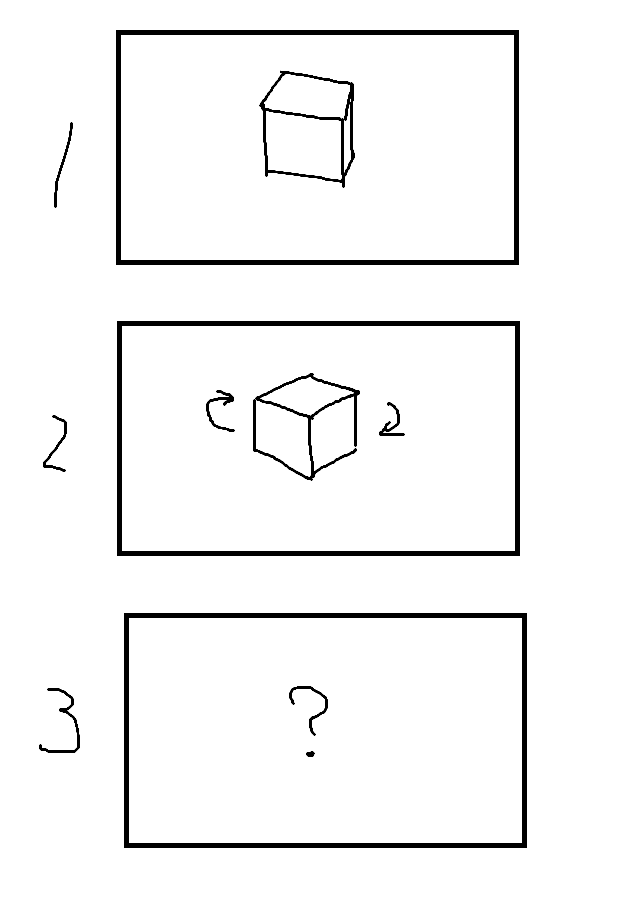
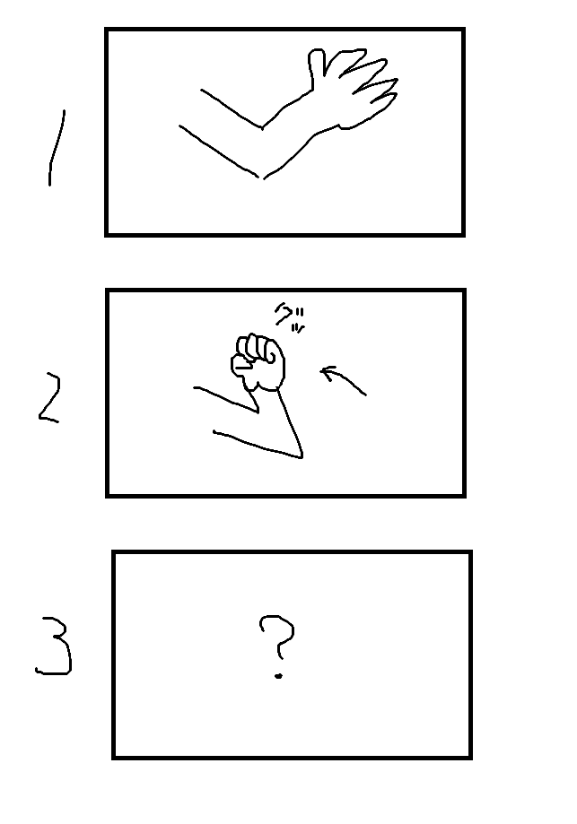

## モーションブラーの勉強

モーションブラーには2種類あると考えられる。  
1つ目はカメラがビュンって動いたときに映る残像。  
2つ目は画面内を石がビュンって動いたときに映る残像。  
MMD動画を見ていて、2つ目のモーションブラーはあったほうが良いと感じた。  
ここでは2つ目のモーションブラーに挑戦する。  
深度値や法線情報を画像として出力することができるが、  
そこでさらに、速度情報を画像として出力することを考えることができる。  
速度情報画像を使いボカシを掛ければモーションブラーになる。  
  
### 実装方法  
  
  
  
1. 上図の①が1フレーム目であるとする。
1. 画面中央に灰色の球が表示されている。
1. 上図の②が2フレーム目であるとする。
1. 画面の左側に球が移動している。
1. 2フレーム目を描画するときに、球が以前、何処にいて、今どこにいたかを考える。
1. 1フレーム目の球の座標が(0, 0, 0)、2フレーム目の球の座標が(-2, 0, 0)だとする。
1. 2フレーム目のオブジェクト描画時に(+2, 0, 0)を表す画像を作成し描画する。③  
X=R,Y=G,Z=Bとすると赤色になる。  
移動ナシの部分は(0.5, 0.5, 0.5)で灰色とすることになる気がする。  
1. ②を描画するときに、③を使ってボケさせればモーションブラーになる。  

③の画像を作るときに気を付けないといけないことがある。  
以下のように立方体がその場で回転する場合は下の頂点と上の頂点で  
逆方向になっていなければならない。

さらに気を付けないといけないことがある。  
アニメーションメッシュで肘を曲げたら拳に強いボカシがかかるべきだし、  
肘にボカシはかけてはいけない。  

どうやって実現するのか想像もつかない。  
